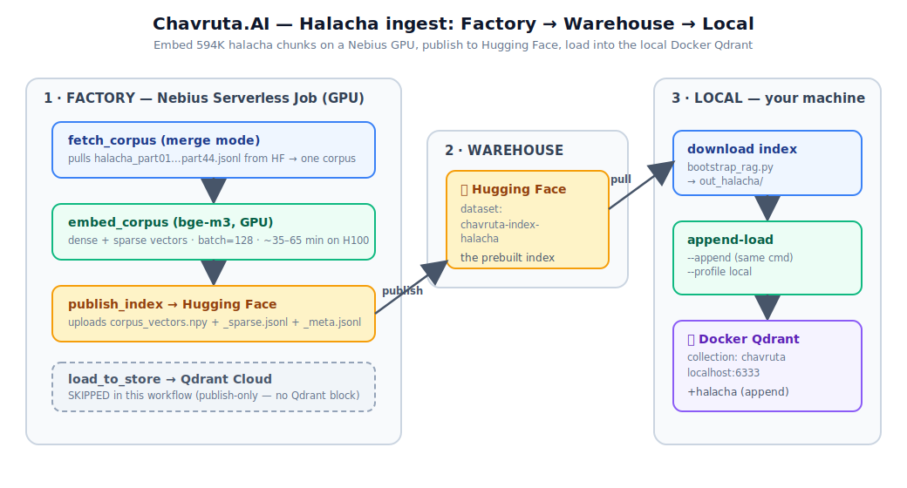
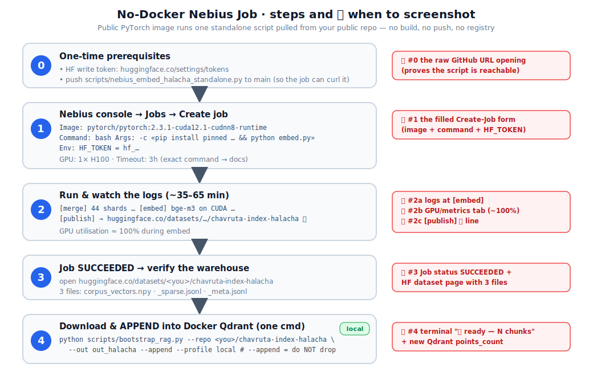
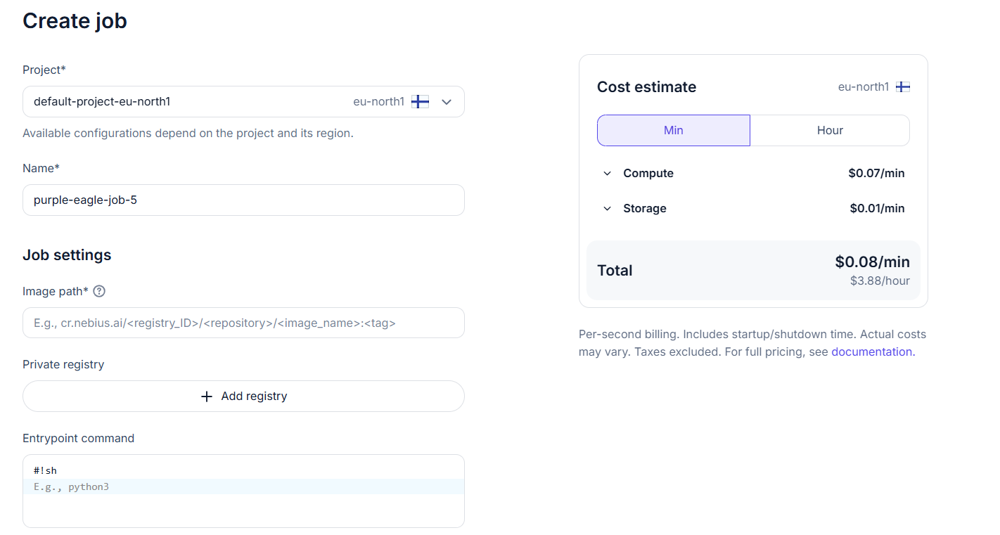
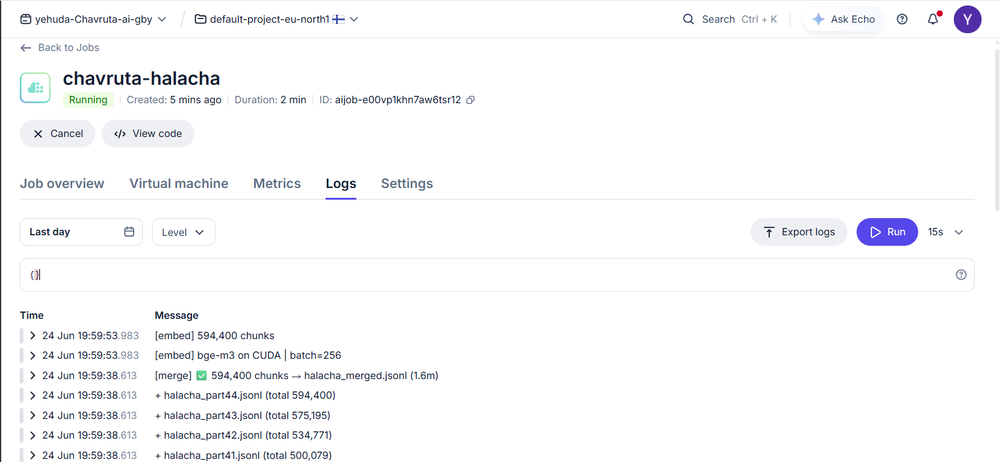
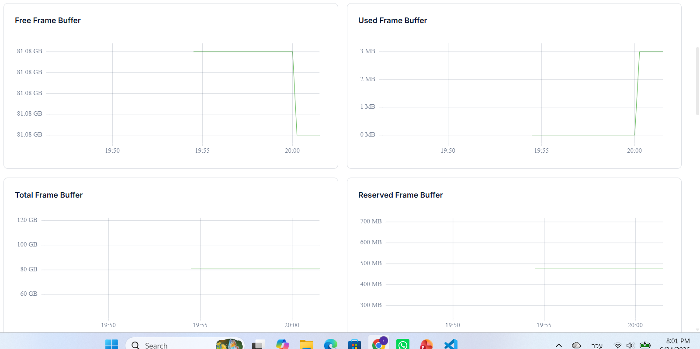

# הטמעת כל ההלכה ב-Nebius — בלי Docker (מדריך מלא)

מדריך שלב-אחר-שלב להטמעת **כל ספריית ההלכה** (44 חלקים · ~594,400 קטעים) על GPU של
Nebius — **בלי לבנות Docker בכלל** — פרסום האינדקס ל-Hugging Face, וטעינתו **מקומית**
ל-Qdrant ב-Docker, בלי למחוק את מה שכבר טעון (תנ"ך + משנה + גמרא + שו"ת).

> **הגישה:** ה-Job מריץ **image ציבורי** של PyTorch, מוריד **סקריפט עצמאי אחד** מהריפו
> הציבורי שלך, ומריץ אותו. אין build, אין push, אין registry. ה-Job גם לא נוגע ב-Qdrant —
> אתה מושך את האינדקס הביתה ומוסיף אותו ל-Docker המקומי בפקודה אחת.

---

## למה זה בנוי ככה

ה-Job הוא **"מפעל"**: מחשב embeddings על GPU. Hugging Face הוא **"מחסן"**: מפיץ את
התוצאה. מחשב הבית שלך **מושך** מהמחסן וטוען מקומית. (ל-Serverless Job יש דיסק זמני ואין
למחשב שלך כתובת ציבורית — ולכן ההעברה עוברת דרך HF.)

> **למה לא ה-API המנוהל של Nebius AI Studio?** כי הקורפוס הקיים שלך מוטמע ב-**bge-m3**
> (1024 ממדים), וה-API המנוהל לא מציע את bge-m3 (רק bge-en-icl / gemma2 / Qwen3 בממדים
> אחרים, לא תואמים). חייבים להריץ את bge-m3 בעצמנו על GPU — ולכן Job.





> הבד‏גלים האדומים (📸) מסמנים בדיוק היכן לצלם מה-console של Nebius / Hugging Face. שמור כל
> צילום בתיקייה [docs/screenshots/](screenshots/) בשם שמופיע ליד כל שלב.

---

## שלב 0 — הכנות (פעם אחת)

| רכיב | סטטוס | פעולה |
|------|-------|-------|
| `HF_TOKEN` (write) | ⚠️ צריך | צור ב-huggingface.co/settings/tokens (הרשאת **write**) |
| הסקריפט העצמאי ב-GitHub | ⚠️ צריך push | `scripts/nebius_embed_halacha_standalone.py` ל-`main` (ראה למטה) |
| חשבון Nebius + GPU quota | — | ה-`NEBIUS_API_KEY` כבר אצלך ב-`.env` |

**הסקריפט העצמאי** — [scripts/nebius_embed_halacha_standalone.py](../scripts/nebius_embed_halacha_standalone.py)
— תלוי רק ב-3 חבילות, וברירות המחדל שלו כבר מכוונות לקורפוס ולאינדקס שלך:
- `CORPUS_REPO=Yehuda-Rubin/chavruta-torah-mixed` · `CORPUS_PREFIX=halacha_part`
- `INDEX_REPO=Yehuda-Rubin/chavruta-torah-mixed`

כדי שה-Job יוכל למשוך אותו, הוא חייב להיות ב-`raw.githubusercontent.com`:
```
https://raw.githubusercontent.com/yehuda-rubin/Chavruta.AI/main/scripts/nebius_embed_halacha_standalone.py
```
(אני יכול לבצע את ה-commit + push של הקובץ הבודד הזה עבורך.)

> 📸 **צילום #0** → `docs/screenshots/00-raw-url.png` — ה-URL הגולמי נפתח בדפדפן (מוכיח שזמין).


---

## שלב 1 — יצירת ה-Job ב-console (הכי פשוט)

ב-console של Nebius → **Serverless → Jobs → Create job**, מלא:

| שדה | ערך |
|-----|-----|
| **Image** | `pytorch/pytorch:2.3.1-cuda12.1-cudnn8-runtime` |
| **Command** | `bash` |
| **Args** | שורה 1: `-c` · שורה 2: הפקודה למטה |
| **Environment** | `HF_TOKEN` = `hf_…` |
| **GPU / preset** | 1× H100 (למשל platform `gpu-h100-sxm`, preset `1gpu-…`) |
| **Timeout** | `3h` |

הפקודה לשדה ה-Args (שים לב — **גרסאות נעולות** כדי למנוע את כשל ה-`AutoModel`):
```bash
pip install -q "FlagEmbedding==1.3.4" "transformers==4.44.2" huggingface_hub numpy && python -c "import urllib.request as u; u.urlretrieve('https://raw.githubusercontent.com/yehuda-rubin/Chavruta.AI/main/scripts/nebius_embed_halacha_standalone.py','embed.py')" && python embed.py
```

> 📸 **צילום #1** → `docs/screenshots/01-create-job.png` — טופס יצירת ה-Job המלא.



### חלופה — דרך ה-CLI
```bash
nebius ai create --type job --name chavruta-halacha \
  --image pytorch/pytorch:2.3.1-cuda12.1-cudnn8-runtime \
  --container-command bash \
  --args "-c pip install -q FlagEmbedding==1.3.4 transformers==4.44.2 huggingface_hub numpy && python -c \"import urllib.request as u; u.urlretrieve('https://raw.githubusercontent.com/yehuda-rubin/Chavruta.AI/main/scripts/nebius_embed_halacha_standalone.py','embed.py')\" && HF_TOKEN=hf_xxx python embed.py" \
  --platform gpu-h100-sxm --preset 1gpu-16vcpu-200gb --timeout 3h
```
> שמות `--platform`/`--preset` משתנים בין אזורים — אם ה-CLI מתלונן, הרץ `nebius ai create --type job --help` או בחר מ-ה-console. ה-console פשוט יותר ועוקף בעיות ציטוט.

---

## שלב 2 — מעקב אחר הלוגים (~35–65 דק')

```bash
nebius ai job get-by-name --name chavruta-halacha     # → JOB_ID
nebius ai job logs <JOB_ID>
```
שלבי הלוג:
```
[merge]  44 shards from Yehuda-Rubin/chavruta-torah-mixed …
[embed]  bge-m3 on CUDA | batch=128
  🧠 128,000/594,400 …
[publish] → https://huggingface.co/datasets/Yehuda-Rubin/chavruta-torah-mixed
[publish] ✅ published
```
ניצול ה-GPU צריך להיות קרוב ל-100% בשלב ה-embed.

> 📸 **צילום #2a** → `docs/screenshots/02a-embed-logs.png` — לוגים בשלב `[embed]`
> 📸 **צילום #2b** → `docs/screenshots/02b-gpu-metrics.png` — לשונית GPU/Metrics (זיכרון/utilization)
> 📸 **צילום #2c** → `docs/screenshots/02c-publish-ok.png` — שורת `[publish] ✅`






---

## שלב 3 — Job הסתיים → אימות המחסן

פתח `https://huggingface.co/datasets/Yehuda-Rubin/chavruta-torah-mixed` ובדוק ששלושת
הקבצים קיימים: `corpus_vectors.npy` · `corpus_sparse.jsonl` · `corpus_meta.jsonl`.

> 📸 **צילום #3** → `docs/screenshots/03-job-succeeded.png` — מצב **SUCCEEDED** + דף ה-HF עם 3 קבצים.


---

## שלב 4 — מקומי: הורדה + הוספה ל-Docker Qdrant

פקודה **אחת** שמורידה את האינדקס ומוסיפה אותו (בלי למחוק את הקיים):

```powershell
.venv\Scripts\python.exe scripts/bootstrap_rag.py `
    --repo Yehuda-Rubin/chavruta-torah-mixed `
    --out out_halacha --append --profile local
```

> ⚠️ **קריטי:** השתמש ב-`--append`. בלעדיו `bootstrap_rag.py` **מוחק** את הקולקשן הקיים
> (596,733 הנקודות של תנ"ך+משנה+גמרא+שו"ת). עם `--append` הוא רק מוסיף.

> 📸 **צילום #4** → `docs/screenshots/04-local-loaded.png` — `➕ --append …` + `✅ ready — N chunks`.


אימות הספירה הסופית:
```powershell
(Invoke-WebRequest http://localhost:6333/collections/chavruta -UseBasicParsing).Content
```
צפוי: ~596,733 + 594,400 ≈ **~1,191,000 נקודות**.

---

## עלות וזמן

| פריט | הערכה |
|------|-------|
| זמן ריצה (H100) | ~35–65 דקות |
| עלות GPU | ~$1–3 (בדוק תעריפים עדכניים) |
| גודל אינדקס שמתפרסם | ~3–4 GB (dense + sparse + meta) |

---

## פתרון תקלות

- **`Could not import module 'AutoModel'`** — אי-תאימות גרסאות. ודא שהגרסאות נעולות בפקודה:
  `FlagEmbedding==1.3.4 transformers==4.44.2` (זה מה שהפיל לנו את בניית ה-Docker).
- **`404` בהורדת הסקריפט** — לא בוצע push ל-`main`, או ה-URL שגוי.
- **`401` בפרסום ל-HF** — ה-`HF_TOKEN` חסר/לא בהרשאת write.
- **OOM בשלב embed** — הוסף `BATCH=64` כמשתנה סביבה ב-Job.
- **הקולקשן נמחק בטעות** — אם שכחת `--append`: טען מחדש את הקורפוסים
  (`load_to_store.py --in out_<each> --no-recreate`), ואז שלב 4 עם `--append`.

---

## קבצים רלוונטיים

- [scripts/nebius_embed_halacha_standalone.py](../scripts/nebius_embed_halacha_standalone.py) — הסקריפט שה-Job מריץ (עצמאי, בלי Docker)
- [scripts/bootstrap_rag.py](../scripts/bootstrap_rag.py) — הורדה + טעינה מקומית (`--append`)

> הערה: קבצי ה-Docker (`docker/Dockerfile.job`, `nebius/job.halacha.yaml`) **אינם בשימוש**
> בגישה הזו ונשארים רק כגיבוי.
